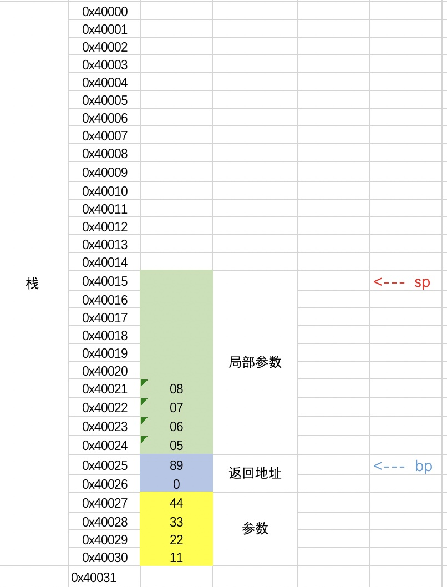
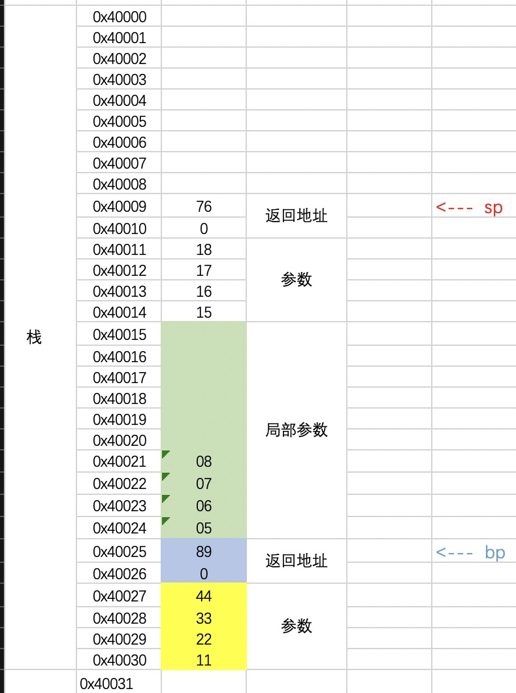
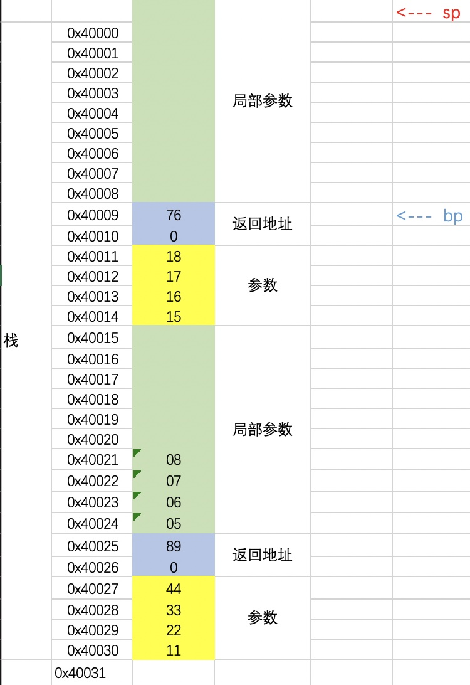
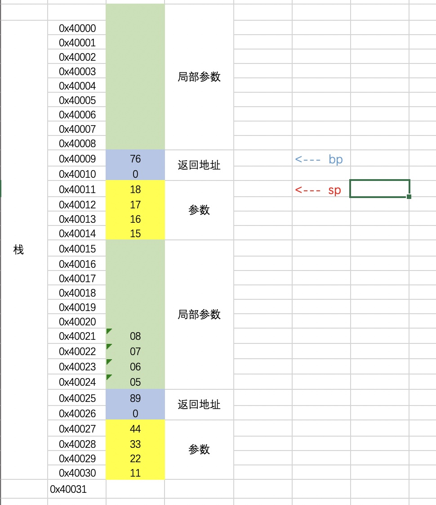
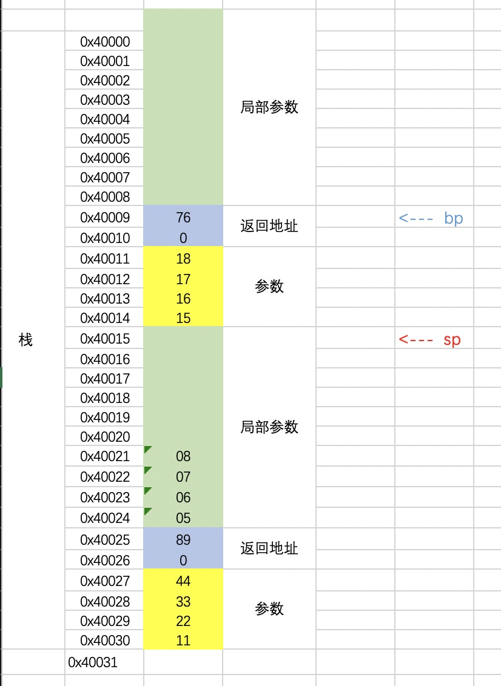
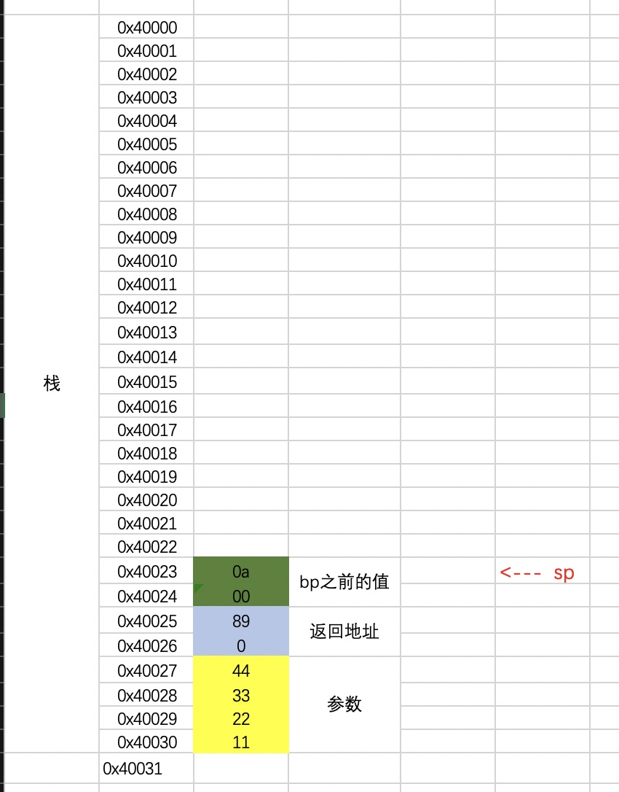
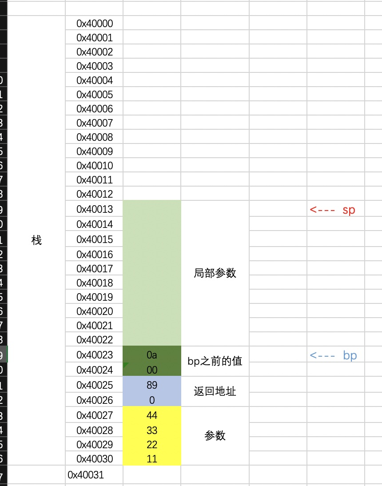

###假设现在的情况是函数里调用函数
```
assume cs:code, ds:data, ss:stack

stack segment
    db 30 dup(99h)  
stack ends    


data segment
   db 10 dup(0)  
   string db 'hello$'
data ends     


code segment
start:
        mov ax, stack
        mov ss, ax
        
        mov ax, data
        mov ds, ax
        
        push 0102h
        push 0304h
        call mathFunc           
        add sp, 4h
                     
        mov bx, ax
          
        ; exit
        mov ah, 4ch
        int 21h

mathFunc:
    mov bp, sp      
    sub sp, 10
    
    mov ss:[bp-2], 0506h
    mov ss:[bp-4], 0708h
    mov ax, ss:[bp-2]
    add ax, ss:[bp-4]    
    mov ss:[bp-6], ax
    
    mov ax, ss:[bp+2]
    add ax, ss:[bp+4]   
    add ax, ss:[bp-6]
    
    push 1516h
    push 1718h
    call mathFunc2
    add sp, 4h

    mov sp, bp
    ret


mathFunc2:
    mov bp, sp      
    sub sp, 10
    
    mov ss:[bp-2], 0506h
    mov ss:[bp-4], 0708h
    mov ax, ss:[bp-2]
    add ax, ss:[bp-4]    
    mov ss:[bp-6], ax
    
    mov ax, ss:[bp+2]
    add ax, ss:[bp+4]   
    add ax, ss:[bp-6]
    
    mov sp, bp
    ret
        
code ends    

end startrt
```

在`mathFunc`函数中调用`push 1516h`这一句之前, 栈的数据和结构如下

随后调用
```
push 1516h
push 1718h
call mathFunc2
```

随后执行`mathFunc2`
```
mov bp, sp      
sub sp, 10
```

随后执行业务逻辑, 直到调用
```
mov sp, bp
ret
```


随后执行`mathFunc`中的`add sp, 4h`, 恢复栈平衡


但是bp的值一直还是在返回地址那, 没有处理, 导致`mathFunc`的下一行代码`mov sp, bp`, 设置sp值就有问题了. 
应该是`mathFunc2`调用完成后, `bp`的值就回到`0x40025`这里, 就是`mathFunc`里的返回地址这.

###保护bp的值

```
assume cs:code, ds:data, ss:stack

stack segment
    db 40 dup(99h)  
stack ends    


data segment
   db 10 dup(0)  
   string db 'hello$'
data ends     


code segment
start:
        mov ax, stack
        mov ss, ax
        
        mov ax, data
        mov ds, ax
        
        push 0102h
        push 0304h
        call mathFunc           
        add sp, 4h
           
        ; exit
        mov ah, 4ch
        int 21h

mathFunc:     
    push bp
    mov bp, sp
    sub sp, 10
    
    mov ss:[bp-2], 0506h
    mov ss:[bp-4], 0708h
    mov ax, ss:[bp-2]
    add ax, ss:[bp-4]    
    mov ss:[bp-6], ax
    
    mov ax, ss:[bp+4]
    add ax, ss:[bp+6]   
    add ax, ss:[bp-6]
    
    mov sp, bp 
    pop bp
    ret
 
code ends    

end start
```
在调用`push bp`之后, 栈如下


调用后
```
mov bp, sp
sub sp, 10
```


随后处理函数的业务逻辑, 直到调用下面代码后
```
mov sp, bp 
;sp和bp都指向0x40023这里

pop bp
;bp的值是0ah了, 就是恢复了bp之前的值
;同时sp指向了0x40025这里

ret
;取出返回地址 进行返回 

;同时外部有add sp, 4h 恢复栈平衡
;sp指向了0x40031这里 同时bp也恢复了之前的值 
```
