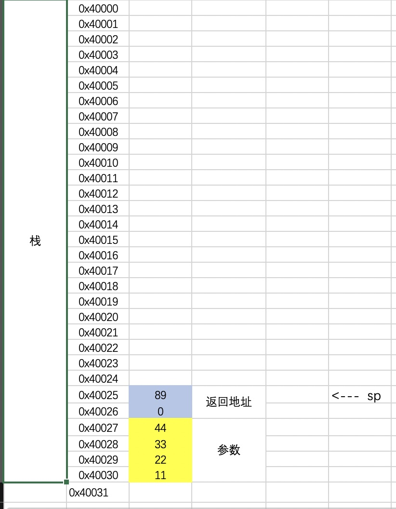
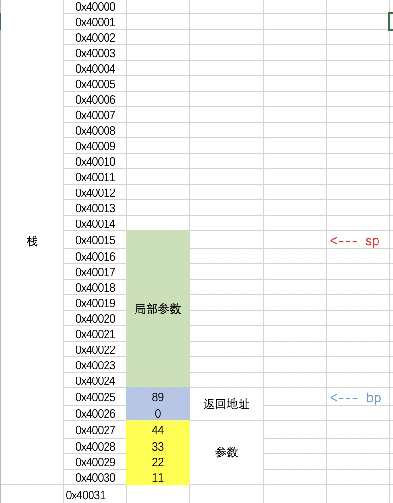
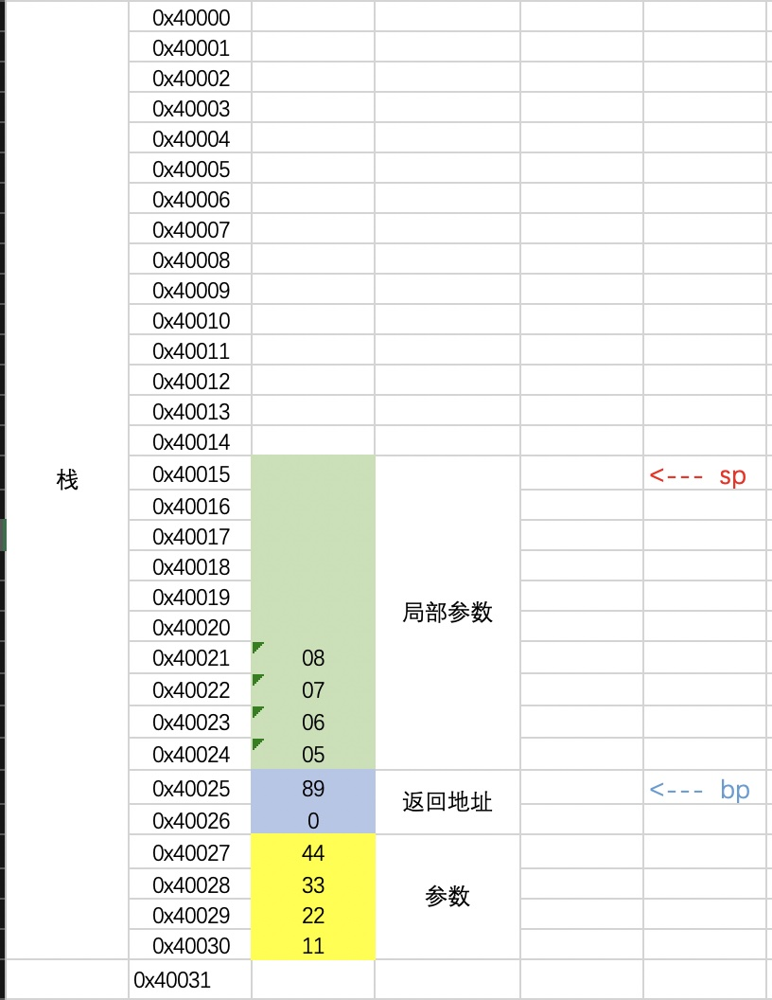

```
assume cs:code, ds:data, ss:stack

stack segment
    db 20 dup(99h)  
stack ends    


data segment
   db 10 dup(0)  
   string db 'hello$'
data ends     


code segment
start:
        mov ax, stack
        mov ss, ax
        
        mov ax, data
        mov ds, ax
        
        push 0102h
        push 0304h
        call mathFunc           
        add sp, 4h
                     
        mov bx, ax
          
        ; exit
        mov ah, 4ch
        int 21h

mathFunc:
    mov bp, sp      
    sub sp, 10
    
    mov ss:[bp-2], 0506h
    mov ss:[bp-4], 0708h
    mov ax, ss:[bp-2]
    add ax, ss:[bp-4]    
    mov ss:[bp-6], ax
    
    mov ax, ss:[bp+2]
    add ax, ss:[bp+4]   
    add ax, ss:[bp-6]
    
    mov sp, bp
    ret
        
code ends    

end startrt
```

###1.通过栈传参, 再调用函数, 栈的数据如下图
```
push 0102h
push 0304h
call mathFunc    
```

###2.函数内的局部变量
为了给局部变量空间, 我们把栈向上移一些空间, 给这个函数分配一些空间来使用
```
mov bp, sp  
sub sp, 10
```

###3.创建局部变量
```
    mov ss:[bp-2], 0506h
    mov ss:[bp-4], 0708h
```

###4.恢复平衡
执行完业务逻辑后 `mov sp, bp`, 把`sp`指针还原, 函数`ret`后, 会把返回地址`pop`出, 最后的`add sp, 4h`, 外平栈恢复栈平衡