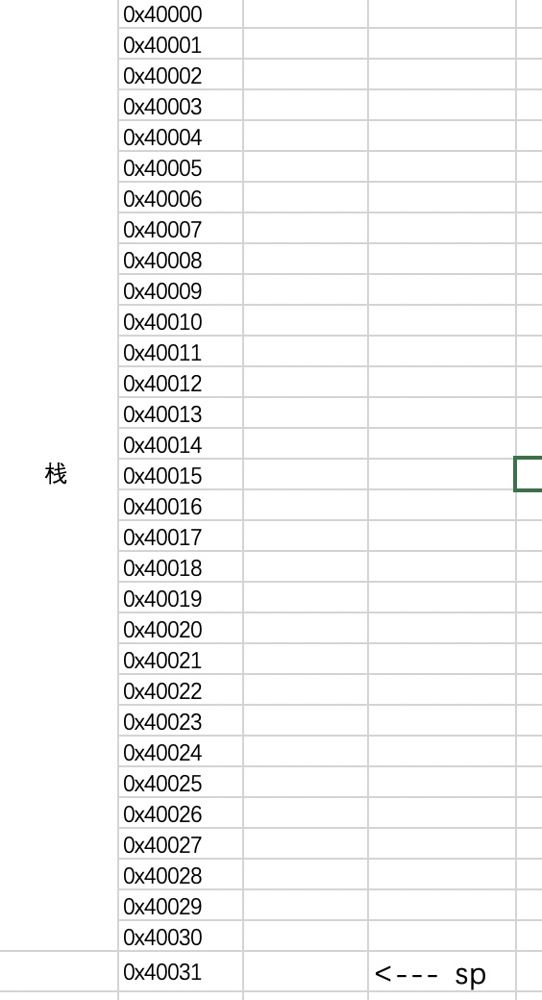
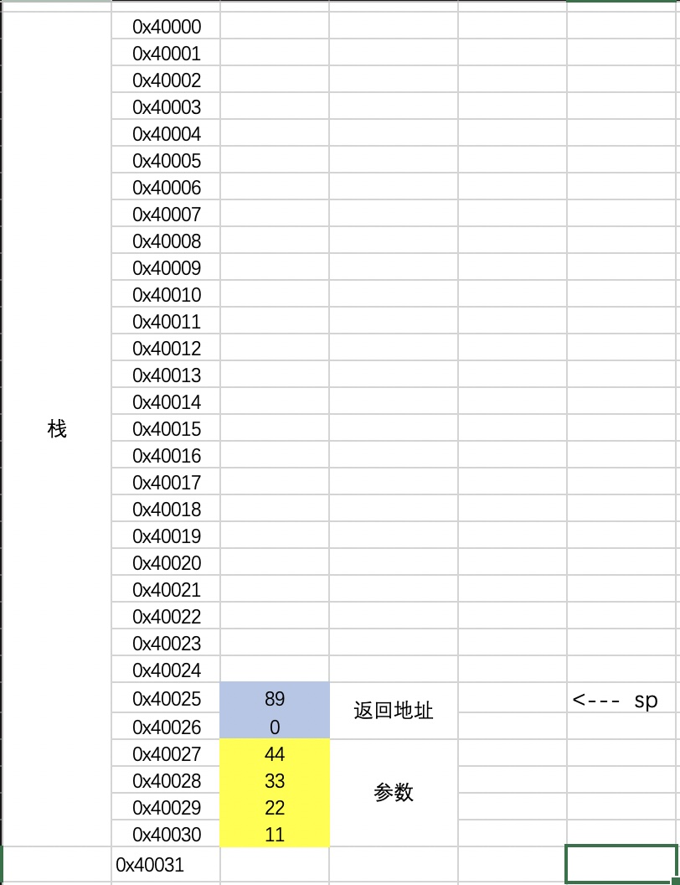
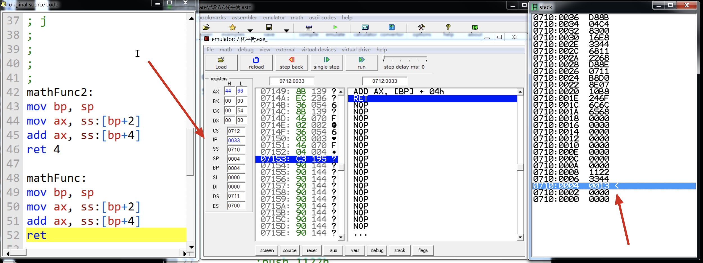
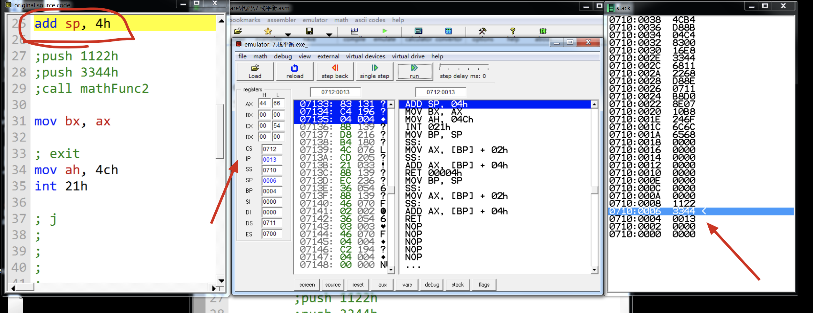
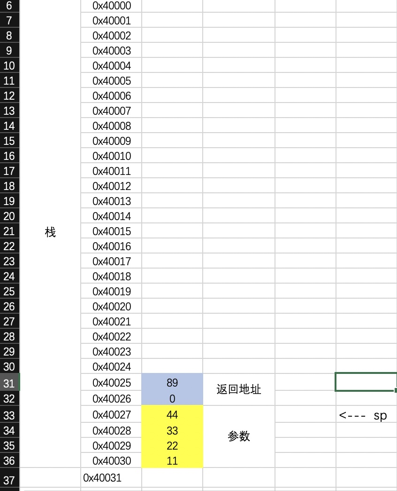
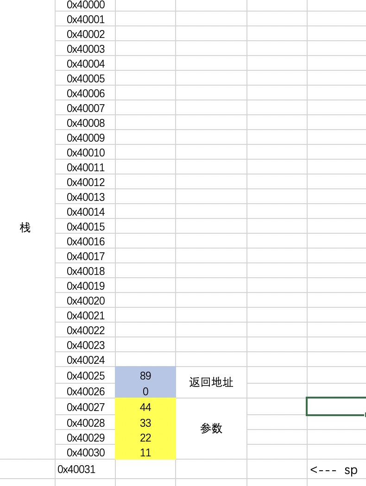

```
assume cs:code, ds:data, ss:stack

stack segment
    db 30 dup(0)  
stack ends    


data segment
   db 10 dup(0)  
   string db 'hello$'
data ends     


code segment
start:
        mov ax, stack
        mov ss, ax
        
        mov ax, data
        mov ds, ax
        
        push 1122h
        push 3344h
        call mathFunc           
        add sp, 4h
                    
        push 1122h
        push 3344h
        call mathFunc2           
                     
        mov bx, ax
          
        ; exit
        mov ah, 4ch
        int 21h

mathFunc2:
    mov bp, sp
    mov ax, ss:[bp+2]
    add ax, ss:[bp+4]
    ret 4
       
mathFunc:
    mov bp, sp
    mov ax, ss:[bp+2]
    add ax, ss:[bp+4]
    ret
        
code ends    

end start
```

假如在栈区申请了30个字节的空间, 空栈时如下



```
push 1122h
push 3344h
call mathFunc2  
```
调用完成后 栈如下


```
mathFunc:
mov bp, sp
mov ax, ss:[bp+2]
add ax, ss:[bp+4]
ret
```
函数调用完成后, `ret`会把返回地址`pop`出
ip指针指向返回地址
sp指针指向参数





返回地址一直在栈中, 不会被清空, 变成了垃圾数据

最后执行, 把sp加4
```
add sp, 4h
;外平栈
```
```
return 4 
;和上面的 add sp, 4h效果一样
;这种是内平栈
```

