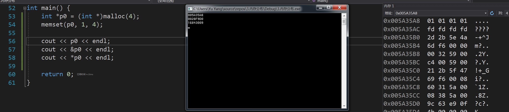
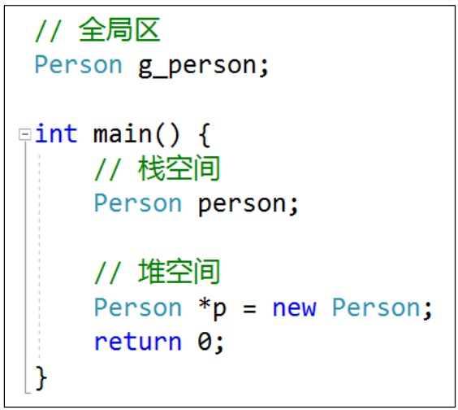

##在程序运行过程，为了能够自由控制内存的生命周期、大小，会经常使用堆空间的内存

###堆空间的申请\释放 
- malloc \ free 
- new \ delete
- new [] \ delete []

###注意 
- 申请堆空间成功后，会返回那一段内存空间的地址 
- 申请和释放必须是1对1的关系，不然可能会存在内存泄露


```
int *p = (int *)malloc(4);
*p = 10;

free(p);
```

```
int *p = new int;
*p = 0xaaaaaaaa;

delete p;
```


```
int *p = new int[4];
p[0] = 1;
p[1] = 2;
p[2] = 3;
p[3] = 4;

delete[] p;
```

###堆空间的初始化
```
int *p0 = (int *)malloc(4);
// 将*p0的每一个字节都初始化为0
memset(p0, 1, 4);

cout << p0 << endl;
cout << &p0 << endl;
cout << *p0 << endl;

// 005A35A8
// 0028F9D0
// 16843009


// 打印 *p0 为什么是 16843009
// *p如果默认是0
// 00000000 00000000 00000000 00000000
// memset为1后
// 00000001 00000001 00000001 00000001
// 转成十进制 就是 16843009
```



```
int *p1 = new int; // 未被初始化
int *p2 = new int(); // 被初始化为0
int *p3 = new int(5); // 被初始化为5
int *p4 = new int[3]; // 数组元素末被初始化
int *p5 = new int[3](); // 3个数组元素都被初始化为0
int *p6 = new int[3]{}; // 3个数组元素都被初始化为0
int *p7 = new int[3]{ 5 }; // 数组首元素被初始化为5，其他元素被初始化为0
```

###对象的内存

对象的内存可以存在于3种地方 
- 全局区(数据段):全局变量 
- 栈空间:函数里面的局部变量 
- 堆空间:动态申请内存(malloc、new等)
