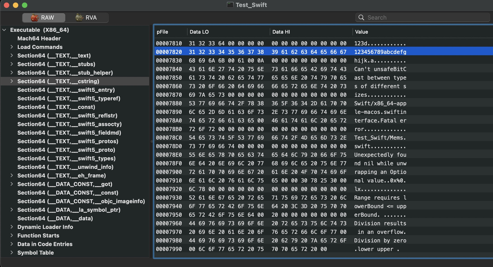

```
var a = "123d"
var b = "123456789abcdefghijk"
// print(UnsafeRawPointer(&a))
// print(UnsafeRawPointer(&b))
```

```
0x000000010000c1f8
0x000000010000c208
(lldb) x/4g 0x000000010000c1f8
0x10000c1f8: 0x0000000064333231 0xe400000000000000
0x10000c208: 0xd000000000000014 0x8000000100007800
(lldb) x/4g 0x000000010000c208
0x10000c208: 0xd000000000000014 0x8000000100007800
0x10000c218: 0x0000000000000000 0x0000000000000000
(lldb) 
```

```
Test_Swift`main:
    0x100003740 <+0>:  pushq  %rbp
    0x100003741 <+1>:  movq   %rsp, %rbp
    0x100003744 <+4>:  leaq   0x40d5(%rip), %rdi        ; "123d"
    0x10000374b <+11>: movl   $0x4, %esi
    0x100003750 <+16>: movl   $0x1, %edx
    0x100003755 <+21>: callq  0x100007558               ; symbol stub for: Swift.String.init(_builtinStringLiteral: Builtin.RawPointer, utf8CodeUnitCount: Builtin.Word, isASCII: Builtin.Int1) -> Swift.String
    0x10000375a <+26>: movq   %rax, 0x8a7f(%rip)        ; Test_Swift.a : Swift.String
    0x100003761 <+33>: movq   %rdx, 0x8a80(%rip)        ; Test_Swift.a : Swift.String + 8
->  0x100003768 <+40>: leaq   0x40c1(%rip), %rdi        ; "123456789abcdefghijk"
    0x10000376f <+47>: movl   $0x14, %esi
    0x100003774 <+52>: movl   $0x1, %edx
    0x100003779 <+57>: callq  0x100007558               ; symbol stub for: Swift.String.init(_builtinStringLiteral: Builtin.RawPointer, utf8CodeUnitCount: Builtin.Word, isASCII: Builtin.Int1) -> Swift.String
    0x10000377e <+62>: movq   %rax, %rcx
    0x100003781 <+65>: xorl   %eax, %eax
    0x100003783 <+67>: movq   %rcx, 0x8a66(%rip)        ; Test_Swift.b : Swift.String
    0x10000378a <+74>: movq   %rdx, 0x8a67(%rip)        ; Test_Swift.b : Swift.String + 8
    0x100003791 <+81>: popq   %rbp
    0x100003792 <+82>: retq   

```
通过下面这行汇编可以看出
```
leaq   0x40a5(%rip), %rdi
movl   $0x4, %esi
callq  0x100007578
```

1. 把一个全局变量的地址值给了rdi (0x00(%rip)这一般是全局变量, 准确来说在_TEXT_cstring_中)
2. 把0x4给了rsi 因为字符串长度是4
3. 随后调用了一个`Swift.String.init`的方法 
4. 比较rsi和0xf
5. 如果小于0xf, 返回rax是具体的值, 如`0x0000000064333231` rdx是`0xe400000000000000` 其中`4`是字符串长度 `e`是标志位
6. 如果大于0xf, 返回rax是`0xd000000000000014` 其`14`是字符串长度 `d0`是标志位 rdx是 `0x8000000100007800` 减去`0x7fffffffffffffe0` 即是真实的字符串地址`0x100007820` 这个值在`Mach-o`文件中如下
   





```
libswiftCore.dylib`Swift.String.init(_builtinStringLiteral: Builtin.RawPointer, utf8CodeUnitCount: Builtin.Word, isASCII: Builtin.Int1) -> Swift.String:
    0x7ff813a039f0 <+0>:   pushq  %rbp
    0x7ff813a039f1 <+1>:   movq   %rsp, %rbp
    0x7ff813a039f4 <+4>:   pushq  %r14
    0x7ff813a039f6 <+6>:   pushq  %rbx
    0x7ff813a039f7 <+7>:   testq  %rsi, %rsi
    0x7ff813a039fa <+10>:  js     0x7ff813a03d32            ; <+834>
    0x7ff813a03a00 <+16>:  movl   %edx, %eax
    0x7ff813a03a02 <+18>:  movabsq $-0x2000000000000000, %rdx ; imm = 0xE000000000000000 
    0x7ff813a03a0c <+28>:  testq  %rsi, %rsi
->  0x7ff813a03a0f <+31>:  je     0x7ff813a03a50            ; <+96>
    0x7ff813a03a11 <+33>:  cmpq   $0xf, %rsi
    0x7ff813a03a15 <+37>:  jle    0x7ff813a03a57            ; <+103>
    0x7ff813a03a17 <+39>:  movabsq $-0x4000000000000000, %rcx ; imm = 0xC000000000000000 
    0x7ff813a03a21 <+49>:  orq    %rsi, %rcx
    0x7ff813a03a24 <+52>:  testb  $0x1, %al
    0x7ff813a03a26 <+54>:  cmoveq %rsi, %rcx
    0x7ff813a03a2a <+58>:  movabsq $0x1000000000000000, %rax ; imm = 0x1000000000000000 
    0x7ff813a03a34 <+68>:  orq    %rcx, %rax
    0x7ff813a03a37 <+71>:  movabsq $0x7fffffffffffffe0, %rdx ; imm = 0x7FFFFFFFFFFFFFE0 
    0x7ff813a03a41 <+81>:  addq   %rdx, %rdi
    0x7ff813a03a44 <+84>:  addq   $0x20, %rdx
    0x7ff813a03a48 <+88>:  orq    %rdi, %rdx
    0x7ff813a03a4b <+91>:  jmp    0x7ff813a03ccc            ; <+732>
    0x7ff813a03a50 <+96>:  xorl   %eax, %eax
    0x7ff813a03a52 <+98>:  jmp    0x7ff813a03ccc            ; <+732>
    0x7ff813a03a57 <+103>: cmpq   $0x8, %rsi
    0x7ff813a03a5b <+107>: movl   $0x8, %r8d
    0x7ff813a03a61 <+113>: cmovleq %rsi, %r8
    0x7ff813a03a65 <+117>: cmpq   $0x3, %r8
    0x7ff813a03a69 <+121>: ja     0x7ff813a03a78            ; <+136>
    0x7ff813a03a6b <+123>: xorl   %r9d, %r9d
    0x7ff813a03a6e <+126>: xorl   %r10d, %r10d
    0x7ff813a03a71 <+129>: xorl   %eax, %eax
    0x7ff813a03a73 <+131>: jmp    0x7ff813a03c40            ; <+592>
    0x7ff813a03a78 <+136>: movq   %r8, %r9
    0x7ff813a03a7b <+139>: andq   $-0x4, %r9
    0x7ff813a03a7f <+143>: leaq   -0x4(%r9), %rax
    0x7ff813a03a83 <+147>: movq   %rax, %r10
    0x7ff813a03a86 <+150>: shrq   $0x2, %r10
    0x7ff813a03a8a <+154>: addq   $0x1, %r10
    0x7ff813a03a8e <+158>: testq  %rax, %rax
    0x7ff813a03a91 <+161>: je     0x7ff813a03d11            ; <+801>
    0x7ff813a03a97 <+167>: movq   %r10, %rcx
    0x7ff813a03a9a <+170>: andq   $-0x2, %rcx
    0x7ff813a03a9e <+174>: negq   %rcx
    0x7ff813a03aa1 <+177>: pxor   %xmm0, %xmm0
    0x7ff813a03aa5 <+181>: movdqa 0x364253(%rip), %xmm7
    0x7ff813a03aad <+189>: xorl   %eax, %eax
    0x7ff813a03aaf <+191>: movdqa 0x364258(%rip), %xmm8
    0x7ff813a03ab8 <+200>: movdqa 0x36425f(%rip), %xmm12
    0x7ff813a03ac1 <+209>: movdqa 0x364266(%rip), %xmm9
    0x7ff813a03aca <+218>: movdqa 0x36426d(%rip), %xmm10
    0x7ff813a03ad3 <+227>: movdqa 0x364274(%rip), %xmm11
    0x7ff813a03adc <+236>: pxor   %xmm2, %xmm2
    0x7ff813a03ae0 <+240>: movdqa %xmm7, %xmm1
    0x7ff813a03ae4 <+244>: pmovzxbq (%rdi,%rax), %xmm5        ; xmm5 = mem[0],zero,zero,zero,zero,zero,zero,zero,mem[1],zero,zero,zero,zero,zero,zero,zero 
    0x7ff813a03aea <+250>: paddq  %xmm8, %xmm1
    0x7ff813a03aef <+255>: pmovzxbq 0x2(%rdi,%rax), %xmm3     ; xmm3 = mem[0],zero,zero,zero,zero,zero,zero,zero,mem[1],zero,zero,zero,zero,zero,zero,zero 
    0x7ff813a03af6 <+262>: movdqa %xmm7, %xmm6
    0x7ff813a03afa <+266>: pand   %xmm12, %xmm6
    0x7ff813a03aff <+271>: pand   %xmm12, %xmm1
    0x7ff813a03b04 <+276>: movdqa %xmm5, %xmm4
    0x7ff813a03b08 <+280>: psllq  %xmm6, %xmm4
    0x7ff813a03b0c <+284>: pshufd $0xee, %xmm6, %xmm6       ; xmm6 = xmm6[2,3,2,3] 
    0x7ff813a03b11 <+289>: psllq  %xmm6, %xmm5
    0x7ff813a03b15 <+293>: movdqa %xmm3, %xmm6
    0x7ff813a03b19 <+297>: psllq  %xmm1, %xmm6
    0x7ff813a03b1d <+301>: pblendw $0xf, %xmm4, %xmm5        ; xmm5 = xmm4[0,1,2,3],xmm5[4,5,6,7] 
    0x7ff813a03b23 <+307>: pshufd $0xee, %xmm1, %xmm1       ; xmm1 = xmm1[2,3,2,3] 
    0x7ff813a03b28 <+312>: psllq  %xmm1, %xmm3
    0x7ff813a03b2c <+316>: por    %xmm0, %xmm5
    0x7ff813a03b30 <+320>: pblendw $0xf, %xmm6, %xmm3        ; xmm3 = xmm6[0,1,2,3],xmm3[4,5,6,7] 
    0x7ff813a03b36 <+326>: por    %xmm2, %xmm3
    0x7ff813a03b3a <+330>: movdqa %xmm7, %xmm1
    0x7ff813a03b3e <+334>: paddq  %xmm9, %xmm1
    0x7ff813a03b43 <+339>: movdqa %xmm7, %xmm4
    0x7ff813a03b47 <+343>: pmovzxbq 0x4(%rdi,%rax), %xmm0     ; xmm0 = mem[0],zero,zero,zero,zero,zero,zero,zero,mem[1],zero,zero,zero,zero,zero,zero,zero 
    0x7ff813a03b4e <+350>: pmovzxbq 0x6(%rdi,%rax), %xmm2     ; xmm2 = mem[0],zero,zero,zero,zero,zero,zero,zero,mem[1],zero,zero,zero,zero,zero,zero,zero 
    0x7ff813a03b55 <+357>: paddq  %xmm10, %xmm4
    0x7ff813a03b5a <+362>: pand   %xmm12, %xmm1
    0x7ff813a03b5f <+367>: movdqa %xmm0, %xmm6
    0x7ff813a03b63 <+371>: psllq  %xmm1, %xmm6
    0x7ff813a03b67 <+375>: pand   %xmm12, %xmm4
    0x7ff813a03b6c <+380>: pshufd $0xee, %xmm1, %xmm1       ; xmm1 = xmm1[2,3,2,3] 
    0x7ff813a03b71 <+385>: psllq  %xmm1, %xmm0
    0x7ff813a03b75 <+389>: pblendw $0xf, %xmm6, %xmm0        ; xmm0 = xmm6[0,1,2,3],xmm0[4,5,6,7] 
    0x7ff813a03b7b <+395>: por    %xmm5, %xmm0
    0x7ff813a03b7f <+399>: movdqa %xmm2, %xmm1
    0x7ff813a03b83 <+403>: psllq  %xmm4, %xmm1
    0x7ff813a03b87 <+407>: pshufd $0xee, %xmm4, %xmm4       ; xmm4 = xmm4[2,3,2,3] 
    0x7ff813a03b8c <+412>: psllq  %xmm4, %xmm2
    0x7ff813a03b90 <+416>: pblendw $0xf, %xmm1, %xmm2        ; xmm2 = xmm1[0,1,2,3],xmm2[4,5,6,7] 
    0x7ff813a03b96 <+422>: por    %xmm3, %xmm2
    0x7ff813a03b9a <+426>: addq   $0x8, %rax
    0x7ff813a03b9e <+430>: paddq  %xmm11, %xmm7
    0x7ff813a03ba3 <+435>: addq   $0x2, %rcx
    0x7ff813a03ba7 <+439>: jne    0x7ff813a03ae0            ; <+240>
    0x7ff813a03bad <+445>: testb  $0x1, %r10b
    0x7ff813a03bb1 <+449>: je     0x7ff813a03c12            ; <+546>
    0x7ff813a03bb3 <+451>: pmovzxbq 0x2(%rdi,%rax), %xmm1     ; xmm1 = mem[0],zero,zero,zero,zero,zero,zero,zero,mem[1],zero,zero,zero,zero,zero,zero,zero 
    0x7ff813a03bba <+458>: movdqa 0x36414e(%rip), %xmm3
    0x7ff813a03bc2 <+466>: paddq  %xmm7, %xmm3
    0x7ff813a03bc6 <+470>: movdqa 0x364152(%rip), %xmm4
    0x7ff813a03bce <+478>: pand   %xmm4, %xmm3
    0x7ff813a03bd2 <+482>: movdqa %xmm1, %xmm5
    0x7ff813a03bd6 <+486>: psllq  %xmm3, %xmm5
    0x7ff813a03bda <+490>: pshufd $0xee, %xmm3, %xmm3       ; xmm3 = xmm3[2,3,2,3] 
    0x7ff813a03bdf <+495>: psllq  %xmm3, %xmm1
    0x7ff813a03be3 <+499>: pblendw $0xf, %xmm5, %xmm1        ; xmm1 = xmm5[0,1,2,3],xmm1[4,5,6,7] 
    0x7ff813a03be9 <+505>: por    %xmm1, %xmm2
    0x7ff813a03bed <+509>: pmovzxbq (%rdi,%rax), %xmm1        ; xmm1 = mem[0],zero,zero,zero,zero,zero,zero,zero,mem[1],zero,zero,zero,zero,zero,zero,zero 
    0x7ff813a03bf3 <+515>: pand   %xmm4, %xmm7
    0x7ff813a03bf7 <+519>: movdqa %xmm1, %xmm3
    0x7ff813a03bfb <+523>: psllq  %xmm7, %xmm3
    0x7ff813a03bff <+527>: pshufd $0xee, %xmm7, %xmm4       ; xmm4 = xmm7[2,3,2,3] 
    0x7ff813a03c04 <+532>: psllq  %xmm4, %xmm1
    0x7ff813a03c08 <+536>: pblendw $0xf, %xmm3, %xmm1        ; xmm1 = xmm3[0,1,2,3],xmm1[4,5,6,7] 
    0x7ff813a03c0e <+542>: por    %xmm1, %xmm0
    0x7ff813a03c12 <+546>: por    %xmm2, %xmm0
    0x7ff813a03c16 <+550>: pshufd $0xee, %xmm0, %xmm1       ; xmm1 = xmm0[2,3,2,3] 
    0x7ff813a03c1b <+555>: por    %xmm0, %xmm1
    0x7ff813a03c1f <+559>: movq   %xmm1, %rax
    0x7ff813a03c24 <+564>: cmpq   %r9, %r8
    0x7ff813a03c27 <+567>: je     0x7ff813a03c5e            ; <+622>
    0x7ff813a03c29 <+569>: leaq   (,%r9,8), %r10
    0x7ff813a03c31 <+577>: nopw   %cs:(%rax,%rax)
    0x7ff813a03c3b <+587>: nopl   (%rax,%rax)
    0x7ff813a03c40 <+592>: movzbl (%rdi,%r9), %ebx
    0x7ff813a03c45 <+597>: movl   %r10d, %ecx
    0x7ff813a03c48 <+600>: andb   $0x38, %cl
    0x7ff813a03c4b <+603>: shlq   %cl, %rbx
    0x7ff813a03c4e <+606>: addq   $0x1, %r9
    0x7ff813a03c52 <+610>: orq    %rbx, %rax
    0x7ff813a03c55 <+613>: addq   $0x8, %r10
    0x7ff813a03c59 <+617>: cmpq   %r9, %r8
    0x7ff813a03c5c <+620>: jne    0x7ff813a03c40            ; <+592>
    0x7ff813a03c5e <+622>: cmpq   $0x9, %rsi
    0x7ff813a03c62 <+626>: jl     0x7ff813a03c9b            ; <+683>
    0x7ff813a03c64 <+628>: leaq   -0x8(%rsi), %r9
    0x7ff813a03c68 <+632>: leaq   -0x9(%rsi), %r10
    0x7ff813a03c6c <+636>: movl   $0x8, %r11d
    0x7ff813a03c72 <+642>: xorl   %ebx, %ebx
    0x7ff813a03c74 <+644>: xorl   %r8d, %r8d
    0x7ff813a03c77 <+647>: cmpq   %r10, %r9
    0x7ff813a03c7a <+650>: jb     0x7ff813a03cd1            ; <+737>
    0x7ff813a03c7c <+652>: movzbl (%rdi,%r11), %r14d
    0x7ff813a03c81 <+657>: movl   %ebx, %ecx
    0x7ff813a03c83 <+659>: andb   $0x38, %cl
    0x7ff813a03c86 <+662>: shlq   %cl, %r14
    0x7ff813a03c89 <+665>: orq    %r14, %r8
    0x7ff813a03c8c <+668>: addq   $0x8, %rbx
    0x7ff813a03c90 <+672>: addq   $0x1, %r11
    0x7ff813a03c94 <+676>: cmpq   %r11, %rsi
    0x7ff813a03c97 <+679>: jne    0x7ff813a03c77            ; <+647>
    0x7ff813a03c99 <+681>: jmp    0x7ff813a03c9e            ; <+686>
    0x7ff813a03c9b <+683>: xorl   %r8d, %r8d
    0x7ff813a03c9e <+686>: movq   %r8, %rcx
    0x7ff813a03ca1 <+689>: orq    %rax, %rcx
    0x7ff813a03ca4 <+692>: movabsq $-0x7f7f7f7f7f7f7f80, %rdi ; imm = 0x8080808080808080 
    0x7ff813a03cae <+702>: testq  %rdi, %rcx
    0x7ff813a03cb1 <+705>: movabsq $-0x6000000000000000, %rcx ; imm = 0xA000000000000000 
    0x7ff813a03cbb <+715>: cmoveq %rdx, %rcx
    0x7ff813a03cbf <+719>: shlq   $0x38, %rsi
    0x7ff813a03cc3 <+723>: orq    %r8, %rsi
    0x7ff813a03cc6 <+726>: orq    %rcx, %rsi
    0x7ff813a03cc9 <+729>: movq   %rsi, %rdx
    0x7ff813a03ccc <+732>: popq   %rbx
    0x7ff813a03ccd <+733>: popq   %r14
    0x7ff813a03ccf <+735>: popq   %rbp
    0x7ff813a03cd0 <+736>: retq   
    0x7ff813a03cd1 <+737>: subq   $0x8, %rsp
    0x7ff813a03cd5 <+741>: leaq   0x379774(%rip), %rax      ; "Swift/Range.swift"
    0x7ff813a03cdc <+748>: leaq   0x379721(%rip), %rdi      ; "Fatal error"
    0x7ff813a03ce3 <+755>: leaq   0x379786(%rip), %rcx      ; "Index out of range"
    0x7ff813a03cea <+762>: movl   $0xb, %esi
    0x7ff813a03cef <+767>: movl   $0x12, %r8d
    0x7ff813a03cf5 <+773>: movl   $0x2, %edx
    0x7ff813a03cfa <+778>: movl   $0x2, %r9d
    0x7ff813a03d00 <+784>: pushq  $0x1
    0x7ff813a03d02 <+786>: pushq  $0x130                    ; imm = 0x130 
    0x7ff813a03d07 <+791>: pushq  $0x2
    0x7ff813a03d09 <+793>: pushq  $0x11
    0x7ff813a03d0b <+795>: pushq  %rax
    0x7ff813a03d0c <+796>: callq  0x7ff813a23060            ; Swift._fatalErrorMessage(_: Swift.StaticString, _: Swift.StaticString, file: Swift.StaticString, line: Swift.UInt, flags: Swift.UInt32) -> Swift.Never
    0x7ff813a03d11 <+801>: pxor   %xmm0, %xmm0
    0x7ff813a03d15 <+805>: movdqa 0x363fe3(%rip), %xmm7
    0x7ff813a03d1d <+813>: xorl   %eax, %eax
    0x7ff813a03d1f <+815>: pxor   %xmm2, %xmm2
    0x7ff813a03d23 <+819>: testb  $0x1, %r10b
    0x7ff813a03d27 <+823>: jne    0x7ff813a03bb3            ; <+451>
    0x7ff813a03d2d <+829>: jmp    0x7ff813a03c12            ; <+546>
    0x7ff813a03d32 <+834>: subq   $0x8, %rsp
    0x7ff813a03d36 <+838>: leaq   0x379923(%rip), %rax      ; "Swift/UnsafeBufferPointer.swift"
    0x7ff813a03d3d <+845>: leaq   0x3796c0(%rip), %rdi      ; "Fatal error"
    0x7ff813a03d44 <+852>: leaq   0x3798e5(%rip), %rcx      ; "UnsafeBufferPointer with negative count"
    0x7ff813a03d4b <+859>: movl   $0xb, %esi
    0x7ff813a03d50 <+864>: movl   $0x27, %r8d
    0x7ff813a03d56 <+870>: movl   $0x2, %edx
    0x7ff813a03d5b <+875>: movl   $0x2, %r9d
    0x7ff813a03d61 <+881>: pushq  $0x1
    0x7ff813a03d63 <+883>: pushq  $0x3b4                    ; imm = 0x3B4 
    0x7ff813a03d68 <+888>: pushq  $0x2
    0x7ff813a03d6a <+890>: pushq  $0x1f
    0x7ff813a03d6c <+892>: pushq  %rax
    0x7ff813a03d6d <+893>: callq  0x7ff813a23060            ; Swift._fatalErrorMessage(_: Swift.StaticString, _: Swift.StaticString, file: Swift.StaticString, line: Swift.UInt, flags: Swift.UInt32) -> Swift.Never
    0x7ff813a03d72 <+898>: nopw   %cs:(%rax,%rax)
    0x7ff813a03d7c <+908>: nopl   (%rax)
```


