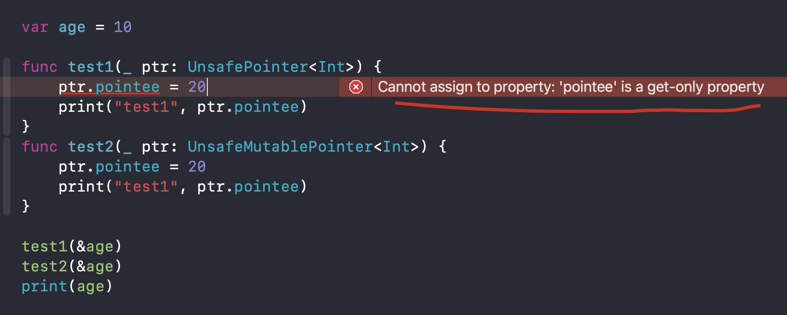

#Swift指针

Swift中也有专门的指针类型，这些都被定性为“Unsafe”(不安全的)，常见的有以下4种类型 

`UnsafePointer<Pointee>` 类似于 `const Pointee *`
`UnsafeMutablePointer<Pointee>` 类似于 `Pointee *`
`UnsafeRawPointer` 类似于 `const void *`
`UnsafeMutableRawPointer` 类似于 `void *`

###示例代码
```
var age = 10

func test1(_ ptr: UnsafePointer<Int>) {
    print("test1", ptr.pointee)
}
func test2(_ ptr: UnsafeMutablePointer<Int>) {
    ptr.pointee = 20
    print("test1", ptr.pointee)
}

test1(&age)
test2(&age)
print(age)
// test1 10
// test1 20
// age 20
```

```
var age = 10

func test3(_ ptr: UnsafeRawPointer) {
    let intValue = ptr.load(as: Int.self)
    print("test3", intValue)
}

func test4(_ ptr: UnsafeMutableRawPointer) {
    let intValue = ptr.load(as: Int.self)
    print("test4", intValue)
    ptr.storeBytes(of: 20, as: Int.self)
}

test3(&age)
test4(&age)
print("age", age)
// test3 10
// test4 10
// age 20
```




###应用

```
var arr = NSArray(objects: 11, 22, 33, 44)
arr.enumerateObjects { <ObjectType>, <UInt>, <UnsafeMutablePointer<ObjCBool>> in
    <code>
}
```


###获得指向某个变量的指针

```

var age = 10

var ptr0 = withUnsafePointer(to: &age) { ptr in

}

var ptr1 = withUnsafePointer(to: &age) { ptr in
    return ptr
}

var ptr2 = withUnsafePointer(to: &age) { $0 }
var ptr3 = withUnsafeMutablePointer(to: &age) { $0 }

print(ptr0)
print(ptr1)
print(ptr1.pointee)

ptr3.pointee = 20
print(ptr2.pointee)
print(age)


// ()
// 0x000000010000c210
// 10
// 20
// 20
```

```
接收两个参数
第一个参数: value: inout T
第二个参数: body: (UnsafePointer<T>) throws -> Result
是个闭包, 参数是UnsafePointer类型, 返回值是Result

返回值是Result
也就是说接收一个闭包, 闭包的返回值, 就是整个函数的返回值(Result)

@inlinable public func withUnsafePointer<T, Result>(to value: inout T, _ body: (UnsafePointer<T>) throws -> Result) rethrows -> Result
```